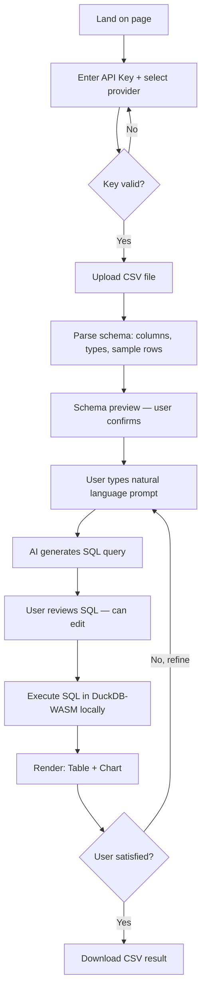

# Mycelia CSV

## Project Context

- **Project Type:** Greenfield
- **Project Mode:** `web-app` (static, deployed on Vercel)
- **Existing Assets:** None
- **Constraints:** Must be 100% static — no backend, no server-side processing, no database
- **Target Users:** Data analysts, ops teams, business users who work with large CSV files (millions of rows) and are frustrated by Excel's row limits and Google Colab's technical barrier

---

## The Story (The Pain)

Your team has millions of rows of data. Excel crashes or refuses to open the file. Google Colab works — but only if you know pandas, Python environments, and how to write transformation logic. The alternative tools (Julius AI, Powerdrill, ChatGPT Advanced Data Analysis) require a monthly subscription AND send your data to their servers — a dealbreaker for sensitive business data.

**The anxiety:** "I have the data, I know what I want to know — but I can't get there without a developer."

**What this solves:** Natural language → AI-generated query logic → browser executes it locally on your CSV → report in seconds. No subscription beyond your own API key. No data leaves your machine. Ever.

---

## Philosophy: Mycelia CSV

**Mycelia CSV**: An underground fungal network that processes nutrients efficiently without being seen on the surface.

**Philosophy**: Much like DuckDB-WASM, it operates incredibly fast in the background without blocking the user interface (UI).

---

## Competitive Edge

| Tool | Server-side | Subscription | Millions of rows | BYOK | Privacy |
|------|-------------|--------------|-----------------|------|---------|
| Julius AI | ✅ Yes | $20/mo | ⚠️ Limited | ❌ | ❌ Data sent to server |
| Powerdrill | ✅ Yes | Paid | ✅ | ❌ | ❌ Data sent to server |
| ChatGPT ADA | ✅ Yes | $20+/mo | ⚠️ Limited | ❌ | ❌ Data sent to server |
| **Mycelia CSV** | ❌ **Never** | **Free** | ✅ **Native** | ✅ | ✅ **100% local** |

**Differentiator:** *"Your data stays on your machine. Always."* — This is not a feature, it's the architecture. DuckDB-WASM runs inside the browser, processes millions of rows locally, and never phones home.

---

## Core Features

### 1. BYOK Key Manager
- User inputs their Anthropic or OpenAI API key
- Key stored only in `sessionStorage` (cleared when tab closes)
- Provider selector (Claude / GPT-4o)
- Visual indicator: key validated ✅ or invalid ❌

### 2. CSV Upload & Schema Preview
- Drag-and-drop or file picker
- Parse first 100 rows via Papa Parse (streaming, non-blocking)
- Display: column names, inferred data types, sample values, total row count
- User confirms or corrects column interpretations before proceeding

### 3. Natural Language → SQL Query (AI Core)
- User types prompt: e.g. *"Show total sales per region, sorted by highest, for Q1 2024"*
- AI receives: schema + sample rows (first 20) + user prompt
- AI returns: a DuckDB-compatible SQL query
- Query shown to user (transparent, editable) before execution

### 4. Local Query Execution (DuckDB-WASM)
- Full CSV loaded into DuckDB-WASM in-browser
- SQL query executed locally — handles millions of rows
- Progress indicator for large files
- Results returned as structured data

### 5. Report Output
- **Interactive table** — sortable, filterable, paginated
- **Auto chart** — AI suggests chart type based on query result shape (bar, line, pie)
- **Download CSV** — export result as CSV

### 6. Query History (Session)
- List of previous prompts + queries in current session
- Re-run or edit any previous query
- Cleared on page refresh (no persistence — privacy first)

---

## Base Features (CRUD)

| Entity | Operations |
|--------|-----------|
| API Key | Set, validate, clear (session only) |
| CSV File | Upload, parse schema, load into DuckDB |
| Prompt | Create, submit, view history |
| SQL Query | View, edit, execute, re-run |
| Report Result | View as table, view as chart, download CSV |

---

## User Flow

---

## Non-Functional Requirements

- **Performance:** CSV parsing must not block UI; use Web Workers. DuckDB query on 1M rows must complete in < 10s on modern hardware.
- **Privacy:** Zero network requests containing user data. API call to AI provider sends ONLY: column names + 20 sample rows + user prompt. Never full CSV.
- **Security:** API key never written to `localStorage`. Cleared on tab close via `sessionStorage` only.
- **Bundle size:** Initial page load < 500KB JS (excluding DuckDB-WASM which loads lazily on file upload).
- **Accessibility:** WCAG 2.1 AA — keyboard navigable, screen reader labels on all interactive elements.
- **Browser support:** Chrome 90+, Firefox 88+, Safari 15+, Edge 90+ (all support WASM + Web Workers).
- **Responsive:** Desktop-first (data work happens on desktop), but functional on tablet.

---

## Success Criteria

- Process a 2M row CSV without browser crash or OOM error
- AI-generated SQL query is correct and executable on first attempt ≥ 80% of the time
- Time from file upload to first query result < 30s for files up to 500MB
- Zero network requests containing CSV data (verifiable via DevTools Network tab)
- Page loads and is usable with JavaScript disabled for key manager UI (progressive enhancement)
