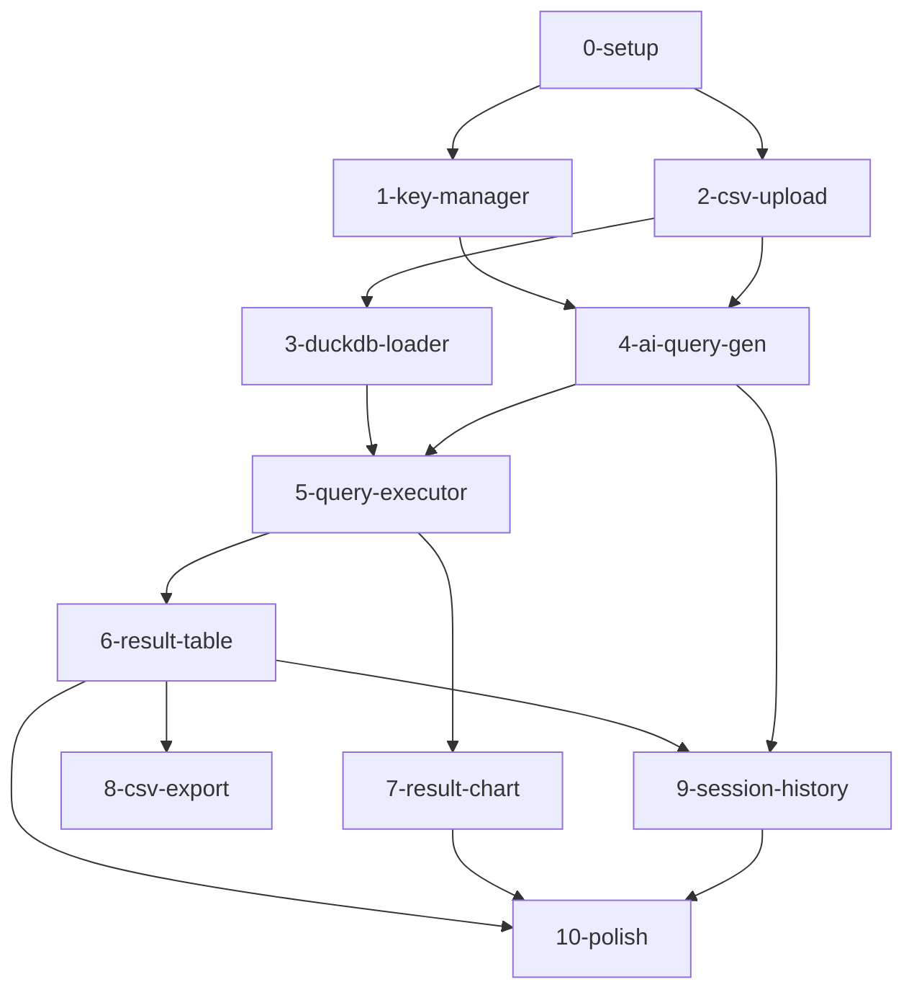

# Global Architecture — CSV AI Reporter

## 1. Global Tech Stack

| Layer | Technology | Version | Rationale |
|-------|-----------|---------|-----------|
| Framework | **Next.js** | 15.x (App Router) | Static export (`output: 'export'`), deploys to Vercel as pure static |
| Language | **TypeScript** | 5.x | Type safety for complex data transforms |
| Styling | **Tailwind CSS** | 4.x | Utility-first, no runtime CSS overhead |
| CSV Parsing | **Papa Parse** | 5.x | Streaming parse, Web Worker support, battle-tested |
| Query Engine | **DuckDB-WASM** | 1.x (`@duckdb/duckdb-wasm`) | Columnar, handles millions of rows in-browser |
| Charts | **Recharts** | 2.x | React-native, composable, no canvas dependency |
| AI (Anthropic) | **Anthropic SDK** | 0.x (browser-safe fetch) | Claude 3.5 Sonnet for SQL generation |
| AI (OpenAI) | **OpenAI SDK** | 4.x | GPT-4o for SQL generation |
| State | **Zustand** | 5.x | Lightweight, no boilerplate, works with Next.js App Router |
| Table | **TanStack Table** | 8.x | Headless, handles large paginated result sets |
| Deploy | **Vercel** | Latest | Zero-config static export hosting |

**Hard constraint:** No API routes. No server functions. `next.config.js` must have `output: 'export'`.

---

## 2. Global Design Rules

- **Desktop-first** — primary users work at a desk with large datasets
- **Color palette:** Dark theme as default (data work = long sessions, reduce eye strain)
  - Background: `#0f1117` (near-black)
  - Surface: `#1a1d27`
  - Border: `#2d3149`
  - Accent: `#6366f1` (indigo-500) — primary actions
  - Success: `#22c55e`, Warning: `#f59e0b`, Error: `#ef4444`
  - Text primary: `#f1f5f9`, Text muted: `#94a3b8`
- **Typography:** Inter (system-ui fallback) — monospace for SQL display (JetBrains Mono)
- **Layout:** Single-page app with left sidebar (session history) + main content area
- **Motion:** Minimal — only loading spinners and progress bars. No decorative animation.
- **Data density:** Prioritize information density over whitespace in table/chart views

---

## 3. Global Data Model (Conceptual, Storage-Agnostic)

All state is in-memory (Zustand store). Nothing persists to disk or localStorage.

| Entity | Key Fields | Relationships | Storage |
|--------|-----------|---------------|---------|
| `ApiConfig` | provider, apiKey, isValid | singleton | In-Memory (sessionStorage for key only) |
| `CsvFile` | fileName, totalRows, fileSizeBytes, rawFile | has one Schema | In-Memory |
| `Schema` | columns[]{name, inferredType, sampleValues} | belongs to CsvFile | In-Memory |
| `DuckDBSession` | db instance, isLoaded, tableRef | singleton | In-Memory (WASM) |
| `QuerySession` | id, prompt, generatedSQL, userEditedSQL, status | has one Result | In-Memory |
| `QueryResult` | rows[], columns[], rowCount, durationMs | belongs to QuerySession | In-Memory |
| `ChartConfig` | type, xKey, yKey, title | belongs to QueryResult | In-Memory |

---

## 4. Module List & Dependencies

| # | Module | Goal | Depends On | Complexity |
|---|--------|------|-----------|-----------|
| 0 | **setup** | Next.js 15 static config, Tailwind, folder structure, env types | — | S |
| 1 | **key-manager** | API key input UI, sessionStorage storage, provider selection, validation ping | 0 | S |
| 2 | **csv-upload** | Drag-drop upload, Papa Parse streaming, schema inference, preview table | 0 | M |
| 3 | **duckdb-loader** | DuckDB-WASM init, CSV ingestion into in-memory table, Web Worker setup | 2 | L |
| 4 | **ai-query-gen** | Prompt → AI → SQL: Anthropic + OpenAI adapters, prompt engineering, response parsing | 1, 2 | M |
| 5 | **query-executor** | SQL editor display, user edits, execute against DuckDB, error handling | 3, 4 | M |
| 6 | **result-table** | TanStack Table with pagination, sort, filter on query results | 5 | M |
| 7 | **result-chart** | Auto chart type selection, Recharts render, chart config UI | 5 | M |
| 8 | **csv-export** | Download result as CSV, filename from prompt slug | 6 | S |
| 9 | **session-history** | Sidebar list of past queries, re-run, copy SQL | 4, 5 | S |
| 10 | **polish** | Loading states, error boundaries, empty states, accessibility audit | All | M |

---

## 5. Dependency Visualization

---

## 6. Risk Chains

| Risk | Affected Modules | Mitigation |
|------|-----------------|-----------|
| DuckDB-WASM fails to load (browser incompatibility) | 3, 5, 6, 7, 8 | Detect WASM support on load; show clear error with browser requirements |
| AI returns invalid SQL | 4, 5 | Catch DuckDB parse error; re-prompt AI with error message for self-correction (max 2 retries) |
| CSV > 2GB causes OOM in browser | 2, 3 | Stream parse with Papa Parse; warn user at 1GB; DuckDB streams file via OPFS if available |
| API key leaked in network request | 1, 4 | Never log requests; use HTTPS only; Content Security Policy blocks unexpected origins |
| Next.js 15 static export breaks dynamic routes | 0 | No dynamic routes — single page SPA only |
